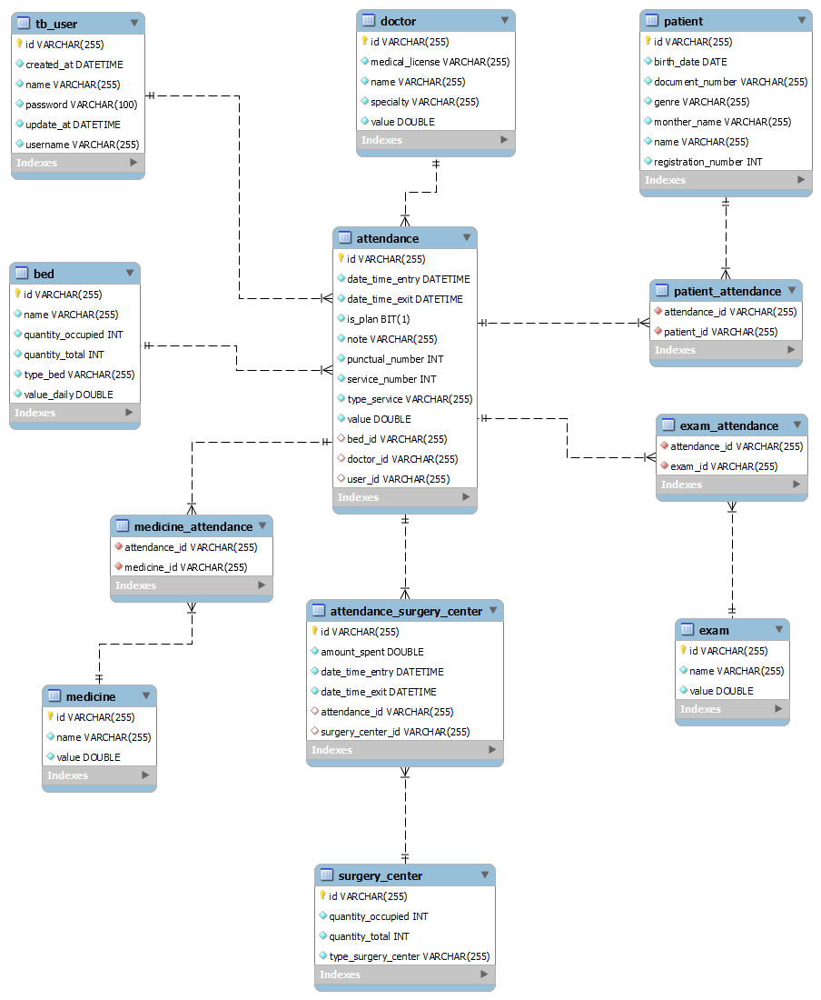

# control-hospital-api

# Executar Projeto

Se for realizar a instalação do `banco manualmente`, voce deve lembrar de passar o `user` e `senha` do banco nas configs da api, caso for executar pelo docker-compose, você pode ignorar esse passo.

Na raiz do projeto: 
 - mvn clean install (Instala as dependências, rodar na raiz) 
 - docker-compose up -d (caso for usar docker compose) 
 - mvn spring-boot:run -PDev (executa api, rodar na raiz) 
 - nohup mvn spring-boot:run & (executa a api em background)
 - http://IP:8080/swagger-ui.html# (acessar documentação pelo Swagger) 

## Diagramas / Fluxogramas

### Classe

### EER

#### Principais bibiliotecas utilizadas

* [Spring Web](https://mvnrepository.com/artifact/org.springframework/spring-web)
* [Spring Boot Starter Data JPA](https://mvnrepository.com/artifact/org.springframework.boot/spring-boot-starter-data-jpa)
* [Spring Boot DevTools](https://mvnrepository.com/artifact/org.springframework.boot/spring-boot-devtools)
* [Hibernate Validator](https://hibernate.org/validator/)
* [Loombok](https://mvnrepository.com/artifact/org.projectlombok/lombok)
* [Swagger](https://swagger.io/)
* [MySQL Connector/J](https://mvnrepository.com/artifact/mysql/mysql-connector-java)
* [JWT](https://jwt.io/introduction)
* [Docker](https://docs.docker.com/)
* [UUID](https://docs.oracle.com/javase/7/docs/api/java/util/UUID.html)

#### Referencias

* [JPA One to One](https://www.baeldung.com/jpa-one-to-one)
* [JPA Many to Many](https://www.baeldung.com/jpa-many-to-many)

#### AUTOR

- [Elias Borges](https://www.linkedin.com/in/eliasborges)
